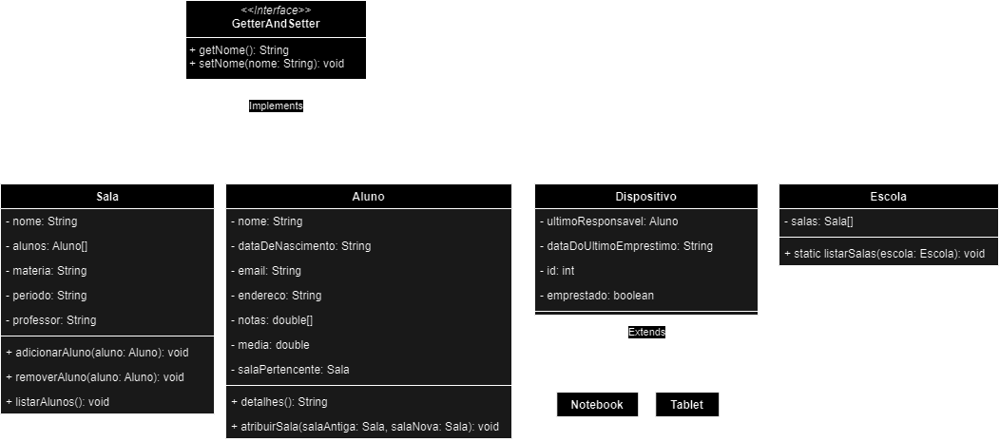

# ☕ Gerenciador Escolar em Java
# Colaboradores:

<table align="center">
  <thead>
    <tr>
      <th>Nome</th>
      <th>Github</th>
    </tr>
  </thead>
  <tbody>
    <tr>
      <td>Daniel Batista Bueno</td>
      <td><a href="https://github.com/bbatistadaniel">bbatistadaniel</a></td>
    </tr>
    <tr>
      <td>Matheus Silveira da Rosa</td>
      <td><a href="https://github.com/Matheus24k">Matheus24k</a></td>
    </tr>
    <tr>
      <td>Gabriel Rodrigues Rolim</td>
      <td><a href="https://github.com/rolim265">rolim265</a></td>
    </tr>
    <tr>
      <td>Diego Alves</td>
      <td><a href="https://github.com/Diegoalves122">Diegoalves122</a></td>
    </tr>
  </tbody>
</table>
 

# 📜 Sobre o Projeto

> ###  1. Porque esse tema?
> O tema foi escolhido após uma análise detalhada e extensas discussões.
Chegou-se à decisão de abordar a administração e organização das escolas,
com base na observação de diversos problemas recorrentes em várias instituições de ensino.
Entre os problemas identificados estão o desaparecimento de materiais, como notebooks,
e a escassez de professores. Este tema visa não apenas identificar e analisar essas questões,
mas também propor soluções práticas e eficazes para melhorar o funcionamento e a qualidade do ambiente escolar.

>### 2. Quais foram as principais dificuldades? 
> As principais dificuldades enfrentadas durante a realização do projeto foram a escassez
de computadores disponíveis para o grupo, a falta de energia elétrica na residência de alguns integrantes
e os desafios na criação do código Main.java, especialmente na hora de recuperar determinadas informações.
Essas questões impactaram o progresso do projeto e exigiram soluções alternativas para garantir o avanço das atividades.
 # Linguagem utilizada:

# Diagrama:   

## Licença: [GPL-3.0](LICENSE)

